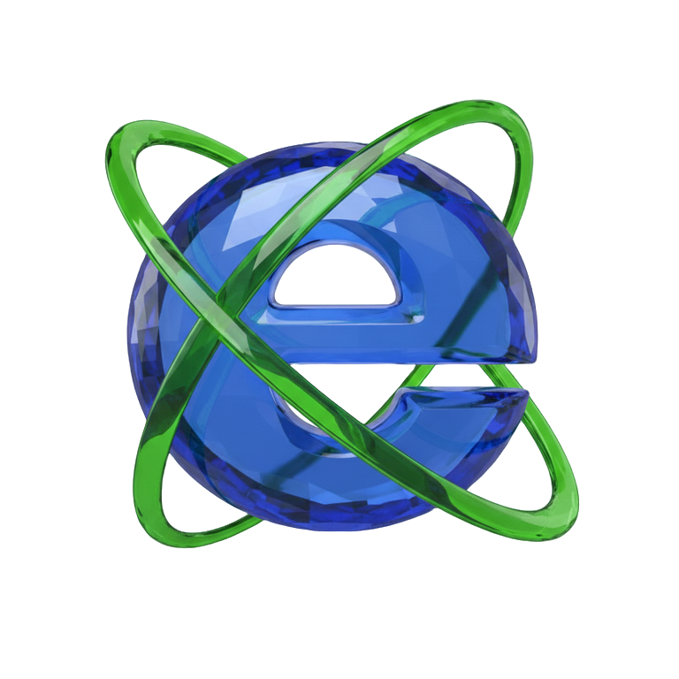
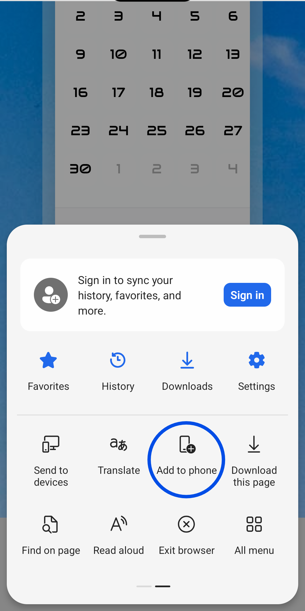
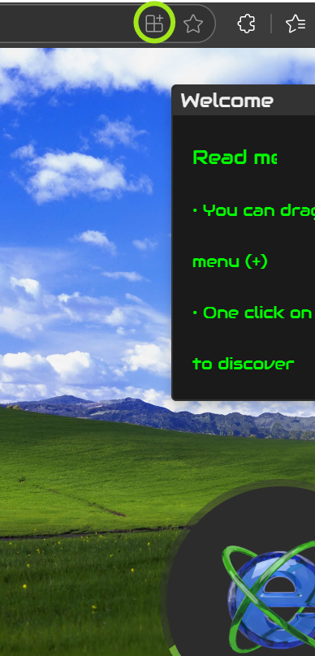

<div align="center">
  <br>
  
  <h1>🪼 Exo Website 🪼</h1>
  <strong>Entertainment-Visual <a href="https://lucia-aranda.github.io/exo/">exo</a> site. Inspired by 2000's techno.</strong>
</div>

## Summary

| #   | Section                                                                                                       |
| --- | --------------------------------------------------------------------------------------------------------------|
| 🪴   | [Main](https://lucia-aranda.github.io/exo/): Website's log, background change and menu.                      |
| 📅   | [Calendar](https://lucia-aranda.github.io/exo/themed_calendar.html): Themes, icons and exportation option.   |
| 🎮   | [Game](https://lucia-aranda.github.io/exo/pairs_game.html): Move count, timer and pairs collected.           |
| 🎧   | [Music Player](https://lucia-aranda.github.io/exo/music_player.html): With visualizer animations.            |
| 🌻   | [Eco Blog](https://lucia-aranda.github.io/exo/eco_blog.html): Mini blog with ecological ideology.            |
| 🖼️   | [Stamps](https://lucia-aranda.github.io/exo/web_stamps.html): Stamps and Gif I found net-surfing.            |

## Prerequisites

To run the project locally, you need a code environment installed on your machine:

- `Visual Studio Code (or any other similar software)`

This optional extension (omit if you already have a virtual server):

```
Live Server by Ritwick Dey
```

And internet conection 🌐 to some features work propertly.

## Concept

This consist on a basic project, taking 2000s design aesthetics such as: Skeuomorphism, Windows XP, Frutiger Aero, Cyber Core, Vector-Flourish, DORFic, Dark Aurora, Cyber Glacier, Frutiger Eco, DSi, Future Core and Glassmorphism. 🌎

A retro-inspired webpage that incorporates JavaScript animations, CSS styling, and a curated set of early 2000s web design elements. It features grid templates, hover effects, gradients, backdrop-filters, draggable menu, PDF exportation and embedded content. The page blends nostalgic aesthetics with some modern front-end features, offering a mix of 3D elements, changing backgrounds, and skeuomorphic design cues. 🖱️

You can explore the DOM structure, inline styles, and event-driven behaviors for both educational insight and creative inspiration. 📚

## Installation

This is a PWA, wich means you can install it from the browser to your own mobile phone 📱 or desk 💻, searching the installation button on the browser's menu.

 

## Contributing

Feel free to DM me 💬 if you'd like to contribute to this project, as well if you have any question(s)/need help/concern(s) about :)

## Quick visualization


